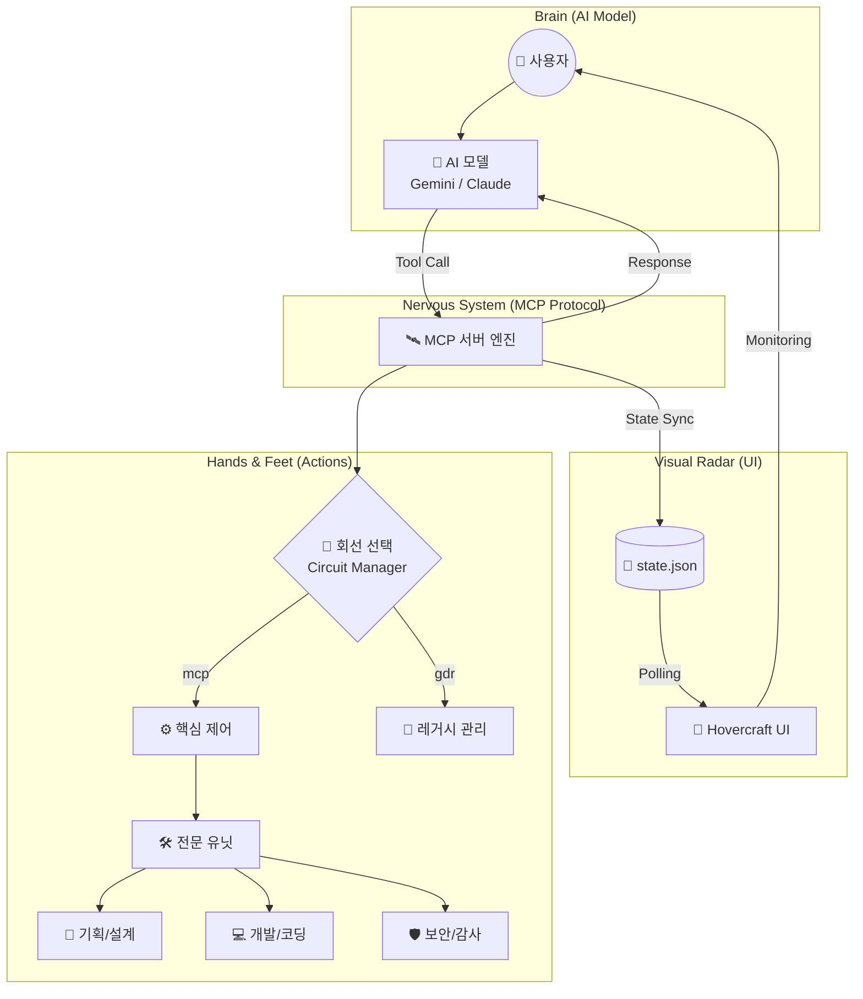

# 🛰️ MCP Operator: AI 지휘 체계 입문 가이드

이 문서는 MCP(Model Context Protocol) 프로젝트가 무엇인지, AI와 실제 시스템이 어떻게 연결되어 작동하는지 비전문가도 이해할 수 있도록 설명합니다.

---

## 1. 핵심 개념: "AI를 위한 만능 리모컨"

사람이 TV를 켤 때 리모컨을 사용하듯, **AI(인공지능)가 내 컴퓨터의 파일을 읽고, 코드를 수정하고, 시스템을 감시할 수 있도록 연결해 주는 표준 규격**이 바로 **MCP**입니다.

- **AI (두뇌):** 무엇을 할지 결정합니다. (예: "로그 창을 넓혀줘", "새 기능을 만들어줘")
- **MCP (신경망):** AI의 결정을 실제 컴퓨터가 알아들을 수 있는 명령으로 전달합니다.
- **Operator (손발):** 실제 명령을 수행하는 엔진입니다.
- **Hovercraft (눈):** 지금 AI가 무엇을 하고 있는지 우리가 볼 수 있게 해주는 화면(대시보드)입니다.

---

## 2. 전체 시스템 흐름도 (UML)

AI 모델이 우리의 요청을 받고 실제 시스템을 제어하기까지의 과정입니다.

---

## 3. 주요 구성 요소 설명

### 🏢 1. 지휘소 (Engine / Server)
시스템의 중추입니다. AI의 요청을 받아서 "이게 안전한 명령인가?" 확인하고, 적절한 부서로 배분합니다.

### 🔌 2. 회선 (Circuits) - "전문 부서"
업무의 성격에 따라 분리된 채널입니다.
- **MCP 회선:** 시스템 자체를 관리하고 설정하는 본부 부서.
- **GDR 회선:** 과거의 유산을 관리하고 연결하는 부서.
- **Research 회선:** 새로운 기술을 탐구하고 분석하는 부서.

### 🛠️ 3. 유닛 (Units) - "전문 도구"
실제 작업을 수행하는 개별 전문가들입니다.
- **Planning:** 어떻게 만들지 전략을 짜는 유닛.
- **Dev:** 직접 코드를 작성하고 수정하는 개발 유닛.
- **Sentinel:** 실수가 없는지, 보안 위험은 없는지 감시하는 보안 유닛.

### 🚀 4. 호버크래프트 (Hovercraft UI)
AI는 눈에 보이지 않게 작동하지만, 사용자는 불안할 수 있습니다. **Hovercraft**는 마치 관제탑의 레이더 화면처럼 AI가 현재 어떤 회선을 쓰고 있는지, 어떤 유닛이 가동 중인지를 실시간으로 보여줍니다.

---

## 4. 데이터가 흐르는 방식 (작동 시나리오)

1.  **명령:** 사용자가 "유닛 화면이 너무 좁아, 넓게 보여줘"라고 말합니다.
2.  **판단:** **AI 모델**이 "아, `CoreAccess` 컴포넌트의 높이 설정을 바꿔야겠군"이라고 판단합니다.
3.  **실행:** AI가 **MCP 서버**에 "파일 수정 도구"를 요청합니다.
4.  **수행:** **MCP 서버**는 `dev` 유닛을 통해 소스 코드를 수정합니다.
5.  **동기화:** 수정된 결과는 `state.json`이라는 상태 파일에 즉시 기록됩니다.
6.  **관측:** **Hovercraft UI**가 2초마다 상태 파일을 확인하다가 변화를 감지하고 화면을 갱신합니다.
7.  **완료:** 사용자는 웹 브라우저에서 즉시 넓어진 화면을 보게 됩니다.

---

**이 시스템은 단순히 코드를 짜는 AI를 넘어, AI가 운영체제와 소프트웨어 전체를 지휘하는 '자율 주행 개발 환경'을 지향합니다.**
