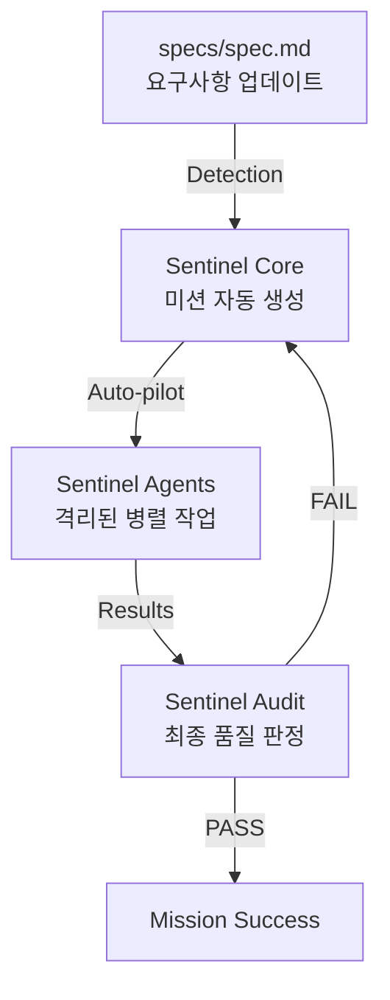

# Sentinel Engineering with Gemini CLI (Auto-pilot)

## 1. Overview

Sentinel Engineering은  
**하나의 AI가 아니라, 메인 Sentinel(오퍼레이터)의 지휘 아래 여러 전문 Sentinel 에이전트를 조합하여 자율적으로 품질을 관리하는 구조**이다.

Gemini CLI 환경에서는 이를 통해 **'스펙 정의 -> 자율 설계 -> 자동 구현 -> 최종 검증'**의 전 과정을 인간의 개입 없이 수행할 수 있다.

---

## 2. Core Concept: Sentinel-driven Auto-pilot

### Sentinel 방식 (자율 운행)
- **감지(Detection):** `specs/` 폴더의 변화를 Sentinel Core가 상시 감시한다.
- **미션 부여(Mission):** 변화 감지 시 `sentinel_set_mission`을 통해 목표와 성공 기준을 자동 설정한다.
- **격리 실행(Execution):** 전문 Sentinel 에이전트들이 독립된 워크트리(`-w`)에서 병렬로 작업을 수행한다.
- **최종 판정(Audit):** `sentinel_evaluate`를 통해 모든 결과물이 스펙을 충족하는지 자동 검증(PASS/FAIL)한다.



---

## 3. Architecture & Sentinel Role

### 3.1 Components

#### 1) Sentinel Core (메인 오퍼레이터)
- 시스템 전체의 흐름을 관제하고 자율 운행을 트리거한다.
- 미션을 설정하고 최종 '합격' 여부를 결정하는 최종 권한자이다.

#### 2) Sentinel Agents (서브 에이전트)
- 특정 전문 분야(Design, Dev, Review 등)를 담당하며, `--worktree` 옵션을 통해 물리적으로 격리된 환경에서 작동한다.

#### 3) Sentinel Protocols (규약)
- 모든 에이전트가 반드시 준수해야 하는 행동 강령이다. 오퍼레이터는 작업 시작 전 이 규약을 각 에이전트에게 주입한다.

---

## 4. Advanced Pipeline (Sentinel Auto-pilot)

### 4.1 세션 격리 및 병렬 실행
Gemini CLI의 세션 잠금을 회피하기 위해 각 Sentinel 에이전트는 고유한 워크트리 이름을 가진다.

```bash
# Sentinel 에이전트들의 병렬 기동 예시
gemini -w sentinel_design -p "Create design based on @spec.md" &
gemini -w sentinel_logic -p "Analyze logic based on @spec.md" &
wait
```

### 4.2 Sentinel 자율 운행 스크립트 (`sentinel_autopilot.sh`)

```bash
#!/bin/bash

# 1단계: Sentinel Core 미션 설정 확인
echo "[Sentinel] Starting Auto-pilot sequence for @specs/spec.md"

# 2단계: 에이전트 가동 (격리 실행)
echo "[Sentinel] Dispatching Design Agent..."
gemini -w s_design -p "You are a Sentinel Architect. Create design.md from @specs/spec.md"

echo "[Sentinel] Dispatching Implementation Agents (Parallel)..."
gemini -w s_feat_a -p "Implement Feature A based on @design.md" > feat_a.py &
gemini -w s_feat_b -p "Implement Feature B based on @design.md" > feat_b.py &
wait

# 3단계: Sentinel Audit (최종 검증)
echo "[Sentinel] Performing Final Audit..."
gemini -p "Verify @feat_a.py and @feat_b.py against @specs/spec.md using sentinel_evaluate."
```

---

## 5. Key Principles

### 5.1 Evidence-based Completion
- "작업이 끝났다"는 판단은 AI의 추측이 아니라, Sentinel Audit의 구체적인 증거 데이터와 테스트 결과에 기반해야 한다.

### 5.2 Strict Session Isolation
- 모든 자동화 단계는 `--worktree`를 통해 세션 간 간섭을 원천 차단한다.

### 5.3 Protocol-first Engineering
- 모든 에이전트는 작업 수행 전 해당 회선의 `Protocols`를 최우선으로 로드하고 준수한다.

---

## 6. Conclusion

Sentinel Engineering의 핵심은 **"AI를 도구가 아니라, 규약(Protocols)에 의해 통제되고 센티널(Sentinel)에 의해 품질이 보증되는 자율 주행 팀"**으로 운용하는 것이다.

이를 통해 개발 생산성을 극대화하고 결함 없는 자산을 지속적으로 생산할 수 있다.
